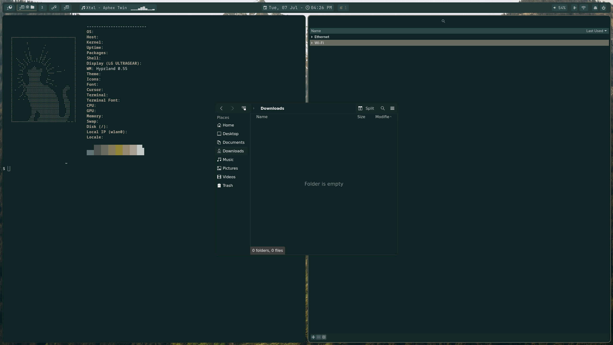
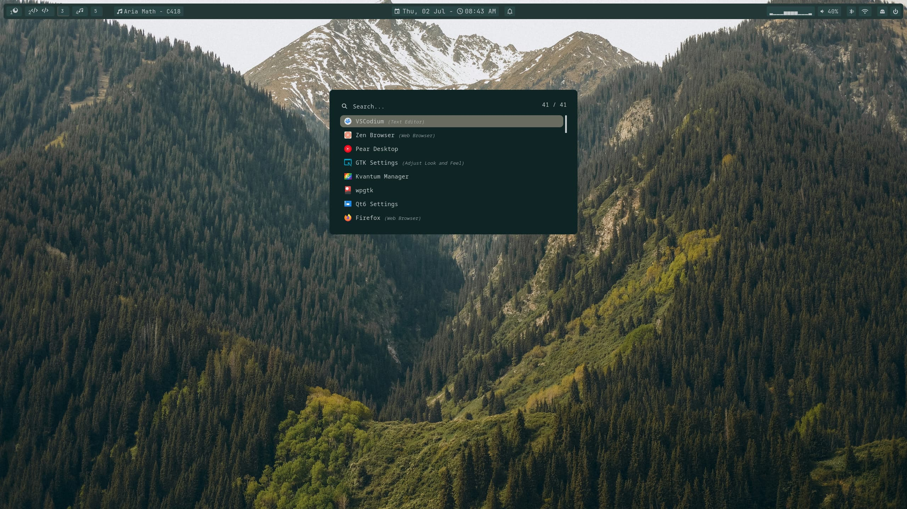
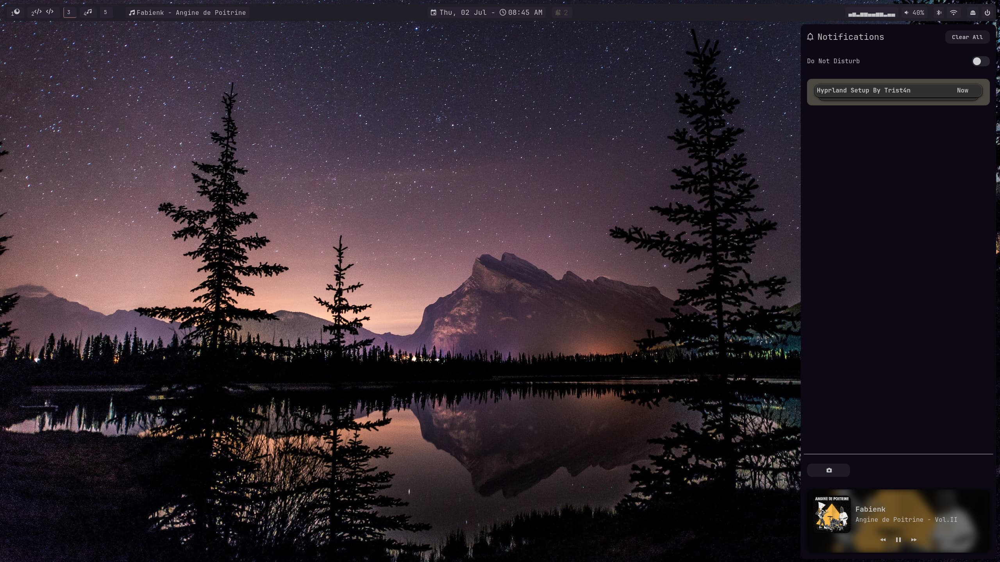
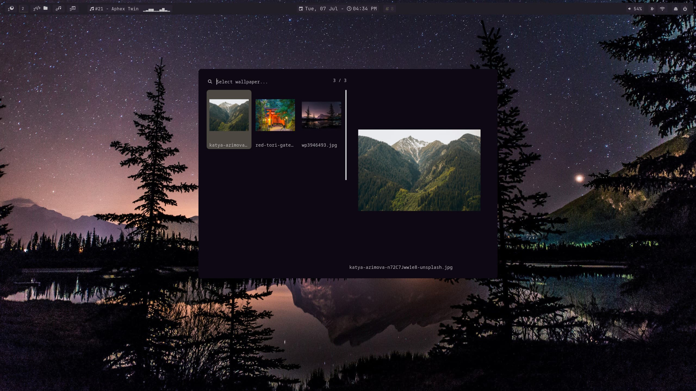

[](https://github.com/ByTrist4n/hyprland-setup)
[](https://github.com/ByTrist4n/hyprland-setup)
[](https://github.com/ByTrist4n/hyprland-setup)

[](https://git.io/typing-svg)

<!-- TABLE OF CONTENTS -->
<details>
  <summary>Table of Contents</summary>
  <ol>
    <li>
      <a href="#what-is-it">What is it?</a>
        <ul>
            <li><a href="#hyprland-setup-showcase">Hyprland Setup Showcase</a></li>
        </ul>
    </li>
    <li>
      <a href="#getting-started">Getting Started</a>
        <ul>
            <li><a href="#prerequisites">Prerequisites</a></li>
            <li><a href="#installation">Installation</a></li>
        </ul>
    </li>
    <li><a href="#Features">Features</a></li>
    <li><a href="#tech-stack">Tech Stack</a></li>
        <ul>
            <li><a href="#-core-dependencies-pacman">📦 Core Dependencies (Pacman)</a></li>
            <li><a href="#-aur-dependencies-yay">🛸 AUR Dependencies (Yay)</a></li>
            <li><a href="#-shell-frameworks--plugins-">⚡ Shell Frameworks & Plugins</a></li>
        </ul>
    <li><a href="#do-you-have-any-ideas-">Do you have any ideas 💡?</a></li>
    <li><a href="#do-you-have-bugs-">Do you have bugs 💡?</a></li>
    <li><a href="#roadmap">Roadmap</a></li>

  </ol>
</details>

<br>

# What is it?

Here is a script to configure the Hyprland of dreams ✨

He is a simply one shot script to Setup your Hyprland.

For example, after a fresh install or if you simply fancy a change of style 😎

> 🫰 Thank you for the stars ⭐

## Hyprland Setup Showcase


<details>
  <summary><b>✨ Click here to see more screenshots of the Hyprland setup</b></summary>
  <br>

**Information Bar**

**App Launcher**

**Notifications center**

**Theme switcher**


</details>

<br>

# Getting Started

## Prerequisites

- Hyprland v0.55 minimum with lua, run :
  ```bash
  hyprland --version
  ```

## Installation

To install, clone the repository and execute the installation script from the root directory:
Bash

```bash
git clone https://github.com/ByTrist4n/hyprland-dot-files.git
cd hyprland-dot-files
sh install.sh
```

# Features

- **Information Bar**
- **App Launcher**
- **Notifications center**
- **Theme Switcher** : Use the colors from the current wallpaper and apply them to all applications in the environment (GTK, Qt, etc)
- **Intuitive keyboard shortcuts** for screenshots, launchers, emoji, Theme switching, and more !

<br>

# Tech Stack

[](https://archlinux.org)
[](https://hypr.land)

## 📦 Pacman Packages

| Package                                                                                                | Description                                              |
| :----------------------------------------------------------------------------------------------------- | :------------------------------------------------------- |
| 🐚 [zsh](https://github.com/zsh-users/zsh)                                                             | Advanced shell replacement for Bash                      |
| 📝 [nvim](https://github.com/neovim/neovim)                                                            | Vim-based text editor for configuration                  |
| 🚀 [yay](https://github.com/Jguer/yay)                                                                 | AUR helper and pacman wrapper                            |
| ☀️ [brightnessctl](https://github.com/Hummer12007/brightnessctl)                                       | Lightweight brightness control utility                   |
| 🔊 [pavucontrol](https://gitlab.freedesktop.org/pulseaudio/pavucontrol)                                | PulseAudio/PipeWire volume control GUI                   |
| 🔵 [blueman](https://github.com/blueman-project/blueman)                                               | Bluetooth management GTK tool                            |
| 🔤 [ttf-jetbrains-mono-nerd](https://github.com/ryanoasis/nerd-fonts)                                  | Developer font with specialized glyphs and icons         |
| 📋 [wl-clipboard](https://github.com/bugaevc/wl-clipboard)                                             | Command-line copy/paste utilities for Wayland            |
| 🔒 [hyprlock](https://github.com/hyprwm/hyprlock)                                                      | Fast, secure screen locker for Hyprland                  |
| 💤 [hypridle](https://github.com/hyprwm/hypridle)                                                      | Idle management daemon for Hyprland                      |
| 📹 [wf-recorder](https://github.com/ammen99/wf-recorder)                                               | Utility program for Wayland screen recording             |
| 🪟 [slurp](https://github.com/emersion/slurp)                                                          | Select a region in a Wayland compositor                  |
| 🎨 [qt5ct](https://sourceforge.net/projects/qt5ct/) / [qt6ct](https://sourceforge.net/projects/qt5ct/) | Qt5 and Qt6 configuration utilities                      |
| 📜 [cliphist](https://github.com/Sentriz/cliphist)                                                     | Wayland clipboard manager (text and images)              |
| 🔍 [rofi](https://github.com/davatorium/rofi)                                                          | Window switcher and application launcher                 |
| 📸 [flameshot](https://github.com/flameshot-org/flameshot)                                             | Powerful yet simple-to-use screenshot software           |
| 📂 [yazi](https://github.com/sxyazi/yazi)                                                              | Blazing fast terminal file manager written in Rust       |
| 📑 [archlinux-xdg-menu](https://archlinux.org/packages/extra/any/archlinux-xdg-menu/)                  | Automatic XDG menu generator for Arch Linux              |
| ⌨️ [fcitx5](https://github.com/fcitx/fcitx5)                                                           | Flexible input method framework (GTK/Qt/Configtool)      |
| 📦 [zip](https://infozip.sourceforge.net/)                                                             | Compression and file packaging utility                   |
| 📄 [libreoffice-still](https://www.libreoffice.org/)                                                   | Stable branch of the LibreOffice office suite            |
| 🔍 [fzf](https://github.com/junegunn/fzf)                                                              | Command-line fuzzy finder                                |
| 📂 [zoxide](https://github.com/ajeetdsouza/zoxide)                                                     | Smarter cd command for fast directory navigation         |
| 📜 [atuin](https://github.com/atuinsh/atuin)                                                           | Magical shell history synced across machines with SQLite |
| 📁 [eza](https://github.com/eza-community/eza)                                                         | Modern, feature-rich replacement for `ls`                |

## 🛸 AUR Dependencies (Yay)

| Package                                                                               | Description                                             |
| :------------------------------------------------------------------------------------ | :------------------------------------------------------ |
| 🚪 [wlogout](https://github.com/ArtsyMacaw/wlogout)                                   | Wayland-based logout menu                               |
| 🔔 [swaync](https://github.com/ErikReider/SwayNotificationCenter)                     | Sway Notification Center for Wayland                    |
| 🌐 [nm-connection-editor](https://gitlab.gnome.org/GNOME/network-manager-applet)      | NetworkManager advanced connection editor GUI           |
| 🐬 [dolphin](https://invent.kde.org/system/dolphin)                                   | KDE file manager                                        |
| 💻 [vscodium-bin](https://github.com/VSCodium/vscodium)                               | Telemetry-free open-source build of VS Code             |
| 🧭 [zen-browser](https://github.com/zen-browser/desktop)                              | Firefox-based browser focused on privacy                |
| 🎵 [pear-desktop](https://github.com/pear-devs/pear-desktop)                          | Desktop music application                               |
| 🖱️ [logiops](https://github.com/PixlOne/logiops)                                      | Configuration driver for Logitech mice                  |
| 🖼️ [awww](https://codeberg.org/LGFae/awww)                                            | Dynamic wallpaper generator and wrapper                 |
| 🌈 [python-pywal16](https://github.com/eylles/pywal16)                                | Color palette generation from images (Pywal fork)       |
| 🛠️ [wpgtk](https://github.com/deviantfero/wpgtk)                                      | Universal theme template manager using Pywal            |
| 🕶️ [nwg-look](https://github.com/nwg-piotr/nwg-look)                                  | GTK3/4 configuration customization tool for Wayland     |
| 🎨 [papirus-icon-theme](https://github.com/PapirusDevelopmentTeam/papirus-icon-theme) | Material design icon theme for Linux                    |
| 🌌 [kvantum](https://github.com/tsujan/Kvantum)                                       | SVG-based theme engine for Qt5/Qt6                      |
| 📊 [libcava](https://github.com/karlstav/cava)                                        | Console-based Audio Visualizer shared library           |
| 📊 [waybar-git](https://github.com/Alexays/Waybar)                                    | Highly customizable Wayland bar built with Cava support |
| 😃 [rofimoji](https://github.com/fdw/rofimoji)                                        | Emoji, unicode and character picker for Rofi            |
| 🤖 [ydotool](https://github.com/ReimuNotMoe/ydotool)                                  | Generic command-line automation tool for Wayland        |

## ⚡ Shell Framework, Plugins & Integrations

| Tool / Component                                                                   | Description                                                   |
| :--------------------------------------------------------------------------------- | :------------------------------------------------------------ |
| 🧙‍♂️ [Oh My Zsh](https://github.com/ohmyzsh/ohmyzsh)                                 | Framework for managing Zsh configurations                     |
| 💡 [zsh-autosuggestions](https://github.com/zsh-users/zsh-autosuggestions)         | Fish-like fast shell completions as you type                  |
| 🎨 [zsh-syntax-highlighting](https://github.com/zsh-users/zsh-syntax-highlighting) | Fish-shell like syntax highlighting for Zsh                   |
| 📰 ["headline" an Oh My Zsh Theme](https://github.com/moarram/headline)            | Clean and minimal theme for Oh My Zsh                         |
| 💤 [LazyVim](https://github.com/LazyVim/starter)                                   | Neovim setup powered by lazy.nvim for fast configuration      |
| 🎭 [Theme Sw1tcher](https://github.com/ByTrist4n/theme-sw1tcher)                   | Integration tool for dynamic system color palettes and themes |

<br>

# Do you have any ideas 💡?

Come share them in the [discussions section](https://github.com/ByTrist4n/hyprland-setup/discussions).

# Do you have bugs 🐛?

Report them to us in the [discussions section](https://github.com/ByTrist4n/hyprland-setup/discussions).

# Roadmap

- [x] Installation Dependencies
- [x] Theme switcher based on current wallpaper colors
- [x] Information Bar
- [x] App Launcher
- [x] Notifications center
- [ ] Switch from "Waybar" to "Quickshell"
- [ ] Add Quickshell tools/widgets
- [ ] Libraries offering a wide range of themes, with a variety of designs and colours
- [ ] Save the the current `.config` file before installation
- [ ] Improved installation process, with the option of full or partial installation.
