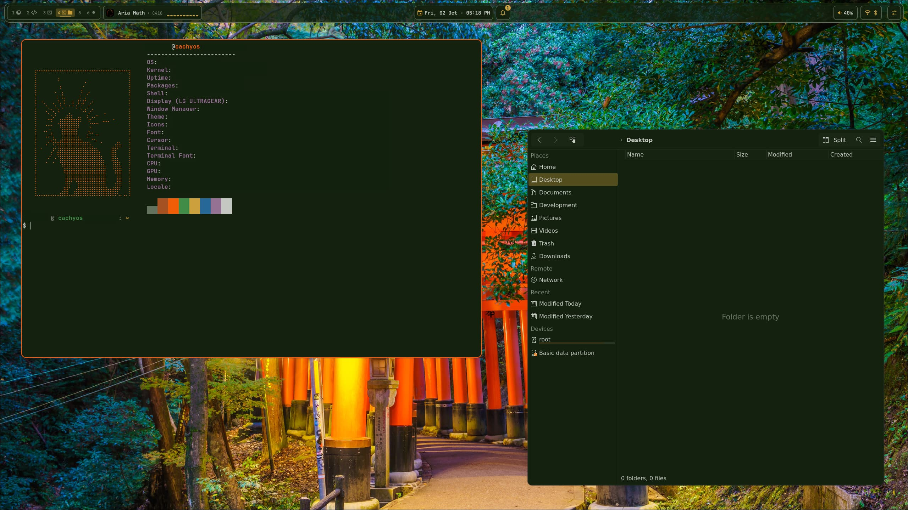
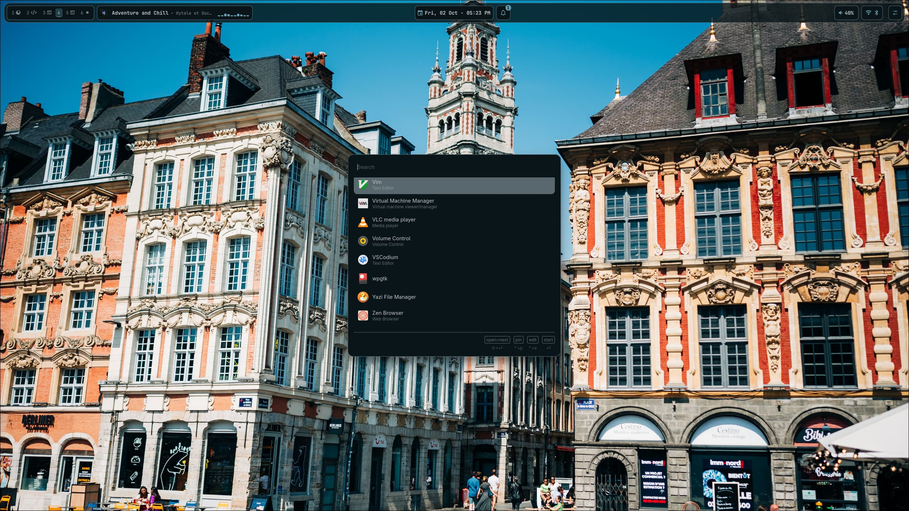
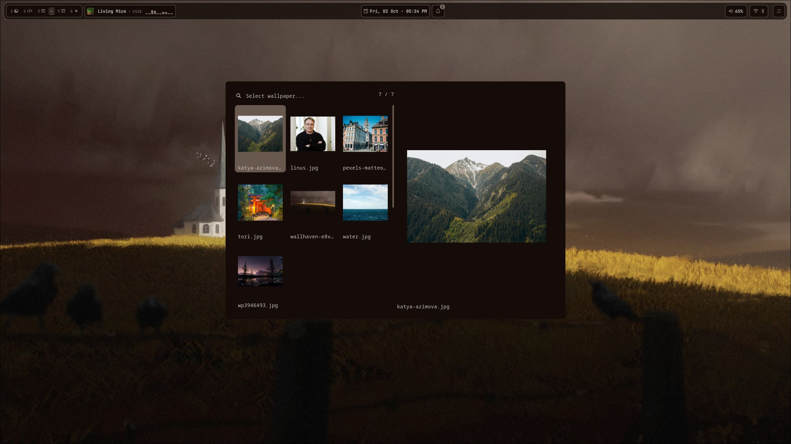
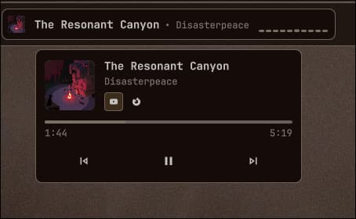
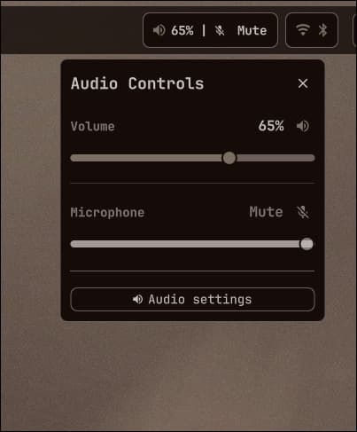
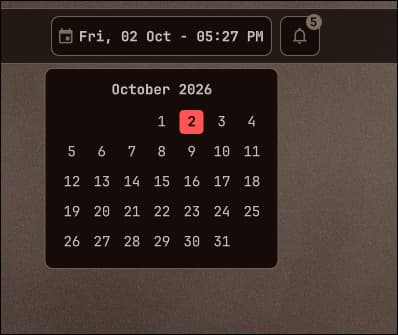
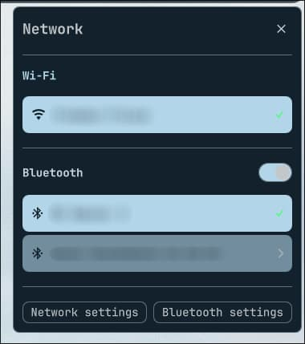
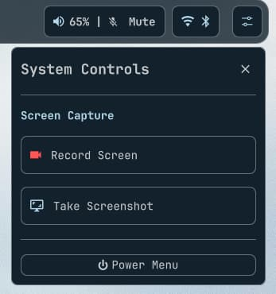

<div align="center">

[](https://git.io/typing-svg)

**A clean, modern, ready-to-use Hyprland desktop, in a single command.**

[](https://github.com/ByTrist4n/hyprland-setup/releases)
[](https://github.com/ByTrist4n/hyprland-setup/commits)
[](https://github.com/ByTrist4n/hyprland-setup/stargazers)
[](https://github.com/ByTrist4n/hyprland-setup)

[](https://archlinux.org)
[](https://cachyos.org)
[](https://hypr.land)
[](https://quickshell.org)

[Showcase](#showcase) • [Installation](#installation) • [Features](#features) • [Packages](#installed-packages) • [Roadmap](#roadmap)

</div>

---

<a id="showcase"></a>

## ✨ Showcase

An automated configuration script that sets up a polished, functional Hyprland environment with a single command. Ideal for fresh **Arch Linux / CachyOS** installs, or when you want to completely revamp your desktop workflow.


<details>
<summary><b>🖼️ Click to expand the full gallery</b></summary>
<br>

### 🖥️ Desktop

<table>
  <tr>
    <td align="center" width="50%">
      <br />
      <b>Desktop</b><br />
    </td>
    <td align="center" width="50%">
      <br />
      <b>App Launcher</b><br />
      <sub>Fast fuzzy search</sub>
    </td>
  </tr>
  <tr>
    <td align="center" width="50%">
      <br />
      <b>Notification Center</b><br />
      <sub>Notifications center</sub>
    </td>
    <td align="center" width="50%">
      <br />
      <b>Theme Switcher</b><br />
      <sub>Pywal Theme Switcher</sub>
    </td>
  </tr>
</table>

### 🧩 Bar popups

<table>
  <tr>
    <td align="center" width="33%">
      <br />
      <b>Media</b><br />
      <sub>Supports multiple MPRIS sources with dynamic player switching, and automatically focuses the corresponding application when clicking the media title.</sub>
    </td>
    <td align="center" width="33%">
      <br />
      <b>Audio Controls</b>
    </td>
    <td align="center" width="33%">
      <br />
      <b>Calendar</b>
    </td>
  </tr>
  <tr>
    <td align="center" width="33%">
      <br />
      <b>Network & Bluetooth</b>
    </td>
    <td align="center" width="33%">
      <br />
      <b>System Controls</b>
    </td>
  </tr>
   <tr>
    <td align="center" width="33%">
      <br />
      <b>Rec Indicator</b>
    </td>
    <td align="center" width="33%">
      <br />
      <b>Mic Indicator</b>
    </td>
     <td align="center" width="33%">
      <br />
      <b>Live + Mic Indicator</b>
    </td>
  </tr>
</table>

</details>

---

<a id="installation"></a>

## 🚀 Installation

> [!IMPORTANT]
> Requires **Hyprland v0.55+** (Lua configuration format). Check your installed version with `hyprland --version`.

```bash
git clone https://github.com/ByTrist4n/hyprland-setup.git
cd hyprland-setup
./install.sh
```

The script will:

1. enable the `multilib` repository if needed,
2. update your system and install the core packages (pacman + AUR),
3. bootstrap `yay` automatically if it is missing,
4. offer to install optional extra applications.

> [!TIP]
> Everything is logged to `/tmp/hyprland-setup-install.log` if something goes wrong.

<details>
  <summary><b>Installation video</b></summary>
  <br>

<video src="https://github.com/user-attachments/assets/7d3ac98f-9228-4832-9aad-633fe276d130"></video>

</details>

---

<a id="features"></a>

## 🎯 Features

|     | Feature                  | Details                                                                                                                                                                         |
| :-: | :----------------------- | :------------------------------------------------------------------------------------------------------------------------------------------------------------------------------ |
| 🐚  | **Quickshell Bar & UI**  | Modern status bar and controls built in QML with Quickshell                                                                                                                     |
| 🚀  | **Walker Launcher**      | App launcher, calculator, clipboard history, symbols/emoji picker and file search (powered by Elephant)                                                                         |
| 🎨  | **Dynamic Theme Engine** | Colors extracted from your wallpaper and applied to Hyprland, GTK, Qt, Kitty and Quickshell thanks to [Pywal Theme Switcher](https://github.com/ByTrist4n/pywal-theme-switcher) |
| 📸  | **Screenshot Workflow**  | Region capture with `grim` + `slurp`, markup with `satty`                                                                                                                       |
| 🎥  | **Screen Recording**     | `gpu-screen-recorder` and `wf-recorder`                                                                                                                                         |
| 🔔  | **Notifications**        | Notification center built into the shell                                                                                                                                        |
| 🔒  | **Lock & Idle**          | `hyprlock` + `hypridle`                                                                                                                                                         |
| ⌨️  | **Input Methods**        | `fcitx5` preconfigured (GTK + Qt)                                                                                                                                               |
| 🧩  | **Modular Installer**    | Core dependencies plus optional extra applications                                                                                                                              |

---

<a id="installed-packages"></a>

## 📦 Installed Packages

<details>
  <summary><b>📦 Core Packages (Pacman)</b></summary>
<br>

| Package                                                                                 | Description                                                             |
| :-------------------------------------------------------------------------------------- | :---------------------------------------------------------------------- |
| 🪟 [`hyprland`](https://github.com/hyprwm/Hyprland)                                     | Dynamic tiling Wayland compositor                                       |
| 🐚 [`quickshell`](https://quickshell.org/)                                              | Flexible toolkit for building desktop shells with QML                   |
| 🔒 [`hyprlock`](https://github.com/hyprwm/hyprlock)                                     | Fast and GPU-accelerated screen locker                                  |
| 💤 [`hypridle`](https://github.com/hyprwm/hypridle)                                     | Wayland-native idle management daemon                                   |
| 🚪 [`sddm`](https://github.com/sddm/sddm)                                               | QML-based display manager                                               |
| 🐱 [`kitty`](https://github.com/kovidgoyal/kitty)                                       | Fast, feature-rich, GPU-based terminal emulator                         |
| 🐬 [`dolphin`](https://invent.kde.org/system/dolphin)                                   | KDE file manager                                                        |
| 📝 [`nvim`](https://github.com/neovim/neovim)                                           | Vim-based text editor for configuration editing                         |
| ✏️ `vim`                                                                                | Classic terminal text editor                                            |
| 🐚 [`zsh`](https://github.com/zsh-users/zsh)                                            | Z shell environment                                                     |
| 🧾 [`fastfetch`](https://github.com/fastfetch-cli/fastfetch)                            | Fast system information tool                                            |
| 📸 [`grim`](https://sr.ht/~emersion/grim)                                               | Wayland screenshot tool                                                 |
| ✂️ [`slurp`](https://github.com/emersion/slurp)                                         | Wayland region selector                                                 |
| 🎨 [`satty`](https://github.com/gabm/satty)                                             | Modern screenshot annotation utility                                    |
| 🎥 [`gpu-screen-recorder`](https://git.dec05eba.com/gpu-screen-recorder/about/)         | GPU-accelerated screen recorder                                         |
| 📹 [`wf-recorder`](https://github.com/ammen99/wf-recorder)                              | Wayland screen recording tool                                           |
| 📊 [`cava`](https://github.com/karlstav/cava)                                           | Console-based audio visualizer                                          |
| 📜 [`cliphist`](https://github.com/Sentriz/cliphist)                                    | Wayland clipboard manager for text and images                           |
| 📋 [`wl-clipboard`](https://github.com/bugaevc/wl-clipboard)                            | Command-line copy/paste utilities                                       |
| 🔊 [`pavucontrol`](https://gitlab.freedesktop.org/pulseaudio/pavucontrol)               | PipeWire / PulseAudio volume control GUI                                |
| 🔵 [`blueman`](https://github.com/blueman-project/blueman)                              | GTK-based Bluetooth manager                                             |
| 🌐 [`nm-connection-editor`](https://gitlab.gnome.org/GNOME/network-manager-applet)      | NetworkManager GUI editor                                               |
| ☀️ [`brightnessctl`](https://github.com/Hummer12007/brightnessctl)                      | Screen brightness control utility                                       |
| ⌨️ [`fcitx5`](https://github.com/fcitx/fcitx5)                                          | Input method framework (`fcitx5-gtk`, `fcitx5-qt`, `fcitx5-configtool`) |
| 🖼️ [`imagemagick`](https://imagemagick.org/)                                            | Image manipulation toolkit                                              |
| 🖼️ `libavif` / `libheif`                                                                | AVIF and HEIF/HEIC image format support                                 |
| 🎨 [`papirus-icon-theme`](https://github.com/PapirusDevelopmentTeam/papirus-icon-theme) | SVG-based icon theme                                                    |
| 🔤 [`ttf-jetbrains-mono-nerd`](https://github.com/ryanoasis/nerd-fonts)                 | Developer font with icon glyphs                                         |
| 😀 `noto-fonts-emoji`                                                                   | Color emoji font                                                        |
| 🎮 `mesa` / `lib32-mesa`                                                                | Open-source OpenGL drivers (64-bit and 32-bit)                          |
| 🌋 `vulkan-icd-loader` / `lib32-vulkan-icd-loader`                                      | Vulkan loader (64-bit and 32-bit)                                       |
| 🧪 `virglrenderer`                                                                      | Virtual GPU renderer for virtualized environments                       |
| 🌍 `inetutils`                                                                          | Basic network utilities (`hostname`, `ping`, etc.)                      |
| 🔧 `base-devel`                                                                         | Build toolchain required for AUR packages                               |
| 🌱 `git`                                                                                | Version control system                                                  |
| 📦 [`zip`](https://infozip.sourceforge.net/)                                            | Compression utility                                                     |
| 📑 [`archlinux-xdg-menu`](https://archlinux.org/packages/extra/any/archlinux-xdg-menu/) | XDG menu generator                                                      |

</details>

<details>
  <summary><b>🛸 Core Packages (AUR)</b></summary>
<br>

| Package                                                | Description                      |
| :----------------------------------------------------- | :------------------------------- |
| 🚶 [`walker`](https://github.com/abenz1267/walker)     | Modern application launcher      |
| 🐘 [`elephant`](https://github.com/abenz1267/elephant) | Data backend for Walker          |
| 📂 `elephant-desktopapplications`                      | Provider: installed applications |
| 🧮 `elephant-calc`                                     | Provider: calculator             |
| 📋 `elephant-clipboard`                                | Provider: clipboard history      |
| 😃 `elephant-symbols`                                  | Provider: symbols and emoji      |
| 🔎 `elephant-files`                                    | Provider: file search            |
| 🚪 [`wlogout`](https://github.com/ArtsyMacaw/wlogout)  | Wayland logout menu              |

> `yay` is bootstrapped automatically from the AUR if it is not already installed.

</details>

<details>
  <summary><b>🎨 Theme Engine (via Pywal Theme Switcher)</b></summary>
<br>

| Package                                                                                                 | Source | Description                                                 |
| :------------------------------------------------------------------------------------------------------ | :----: | :---------------------------------------------------------- |
| 🌈 [`python-pywal16-git`](https://github.com/eylles/pywal16)                                            |  AUR   | 16-color palette generator from images                      |
| 🛠️ [`wpgtk`](https://github.com/deviantfero/wpgtk)                                                      |  AUR   | Color scheme template engine based on Pywal                 |
| 🖼️ [`awww`](https://codeberg.org/LGFae/awww)                                                            |  AUR   | Dynamic wallpaper daemon                                    |
| 🕶️ [`nwg-look`](https://github.com/nwg-piotr/nwg-look)                                                  |  AUR   | GTK3/4 customization tool for Wayland                       |
| 🌌 [`kvantum`](https://github.com/tsujan/Kvantum)                                                       |  AUR   | SVG-based theme engine for Qt applications                  |
| 🎨 [`qt5ct`](https://sourceforge.net/projects/qt5ct/) / [`qt6ct`](https://github.com/trialuser02/qt6ct) | Pacman | Qt theme configuration utilities                            |
| 🔔 `libnotify`                                                                                          | Pacman | Desktop notifications from scripts                          |
| 🔍 [`rofi`](https://github.com/davatorium/rofi)                                                         | Pacman | Wallpaper picker (optional, if you choose Rofi over Walker) |

> Walker and Elephant, already installed by this script, serve as the alternative wallpaper picker.

</details>

<details>
  <summary><b>💡 Optional Extra Applications</b></summary>
<br>

A single global yes/no confirmation is asked during installation.

| Package                                                        | Source | Description                                 |
| :------------------------------------------------------------- | :----: | :------------------------------------------ |
| 📄 [`libreoffice-still`](https://www.libreoffice.org/)         | Pacman | Stable office suite                         |
| 🎬 [`vlc`](https://www.videolan.org/vlc/)                      | Pacman | Media player                                |
| 📁 [`yazi`](https://github.com/sxyazi/yazi)                    | Pacman | Fast terminal file manager written in Rust  |
| 💻 [`vscodium-bin`](https://github.com/VSCodium/vscodium)      |  AUR   | Telemetry-free open-source build of VS Code |
| 🧭 [`zen-browser-bin`](https://github.com/zen-browser/desktop) |  AUR   | Firefox-based browser focused on privacy    |
| 🖱️ [`logiops`](https://github.com/PixlOne/logiops)             |  AUR   | Driver and utility for Logitech mice        |

</details>

---

<a id="roadmap"></a>

## 🗺️ Roadmap

- [x] Automated dependency installation script
- [x] Quickshell bar integration
- [x] Screenshot and markup workflow (`grim` + `slurp` + `satty`)
- [x] Interactive installation menu with optional software selection
- [x] Calculator in Walker
- [x] Clipboard history in Walker
- [ ] Quickshell widget library
  - [x] Microphone / Live Stream / Camera status indicator
  - [x] Battery widget
  - [x] System control
  - [x] Music pop-up control
  - [ ] Todo block
  - [ ] "Do Not Disturb" mode for notifications
  - [ ] Better system control
- [ ] Color picker shortcut
- [ ] Ability to select multiple optional applications from a list (currently, the installer only offers a global yes/no confirmation for the 6 optional apps)
- [ ] A collection of themes with different designs and colors
- [ ] And more...

---

## 💬 Ideas & Feedback

Have a feature request or an idea? Feel free to start a thread in the [Discussions section](https://github.com/ByTrist4n/hyprland-setup/discussions).

## 🐛 Bug Reports

Encountered an issue? Open a ticket in the [Issues section](https://github.com/ByTrist4n/hyprland-setup/issues).

---

<div align="center">

⭐ **If you like the project, a star always helps!** ⭐

[](https://star-history.com/#ByTrist4n/hyprland-setup&Date)

</div>
